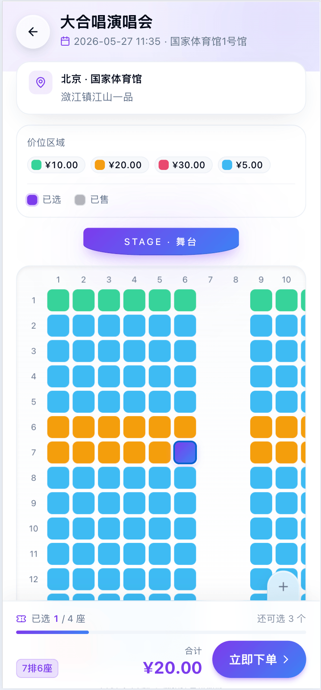
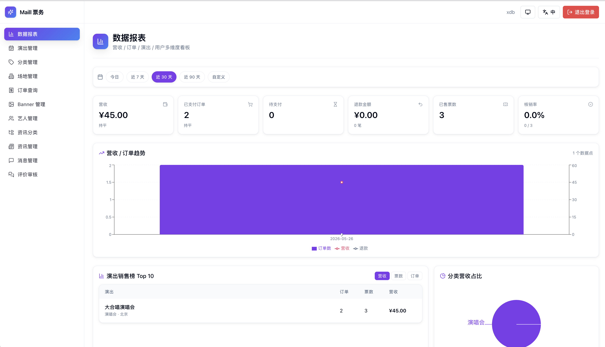
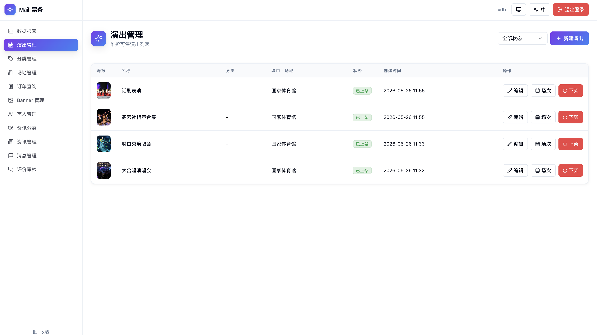
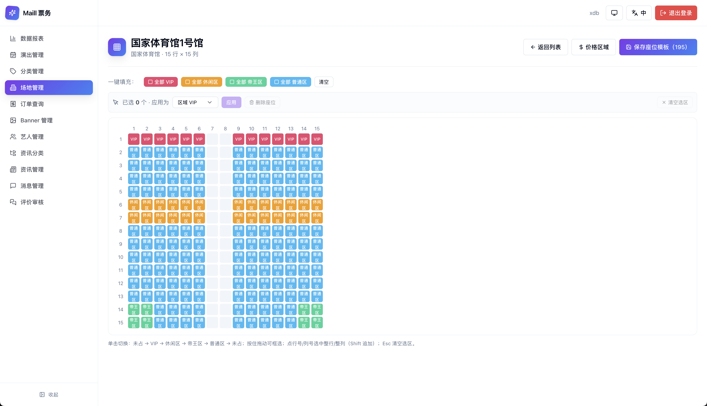
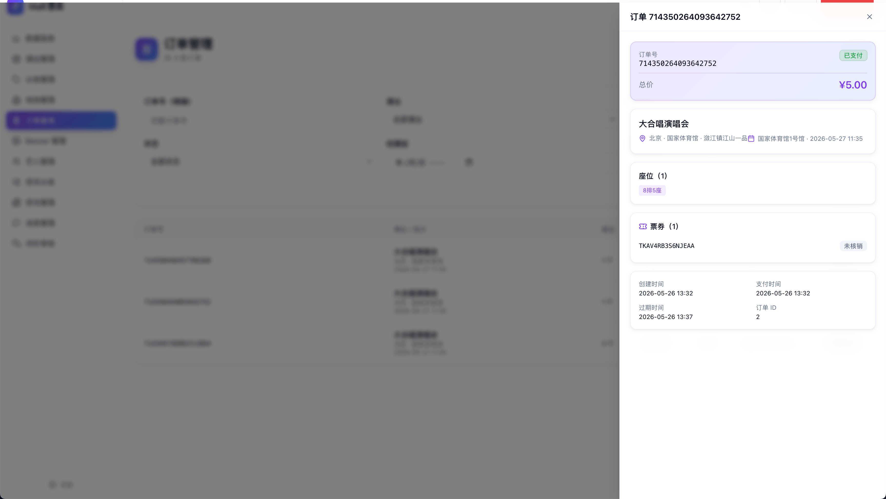

# maill-frontend

订票系统前端，基于 React 18 + TypeScript + Vite 的 pnpm monorepo。配合后端 [maill-backend](https://github.com/Link-X/maill-backend) 使用，覆盖 H5 用户购票 与 PC 商家运营 两端。

## 功能概览

### H5 用户端（`apps/user`）

- 首页演出列表、分类浏览、全局搜索
- 资讯流、演出详情、富文本介绍
- 可视化选座（实时锁座 / 释放）
- 下单 → 支付 → 入场二维码 全流程
- 个人中心：订单管理、收藏、登录态、i18n 多语言

### PC 商家端（`apps/admin`）

- 数据报表（基于 recharts 的销售 / 票房可视化）
- 演出管理、富文本编辑（wangEditor）
- 场地座位模板编辑（可视化排座）
- 订单管理、核销、退票
- 路由级动画、全局主题 token

## 技术栈

- **核心**：React 18、TypeScript 5、Vite 5
- **样式**：Tailwind CSS 3、tailwindcss-animate、统一 design tokens（`@maill/shared/theme/tokens.css`）
- **状态**：Redux Toolkit、React Redux
- **路由**：React Router 6
- **表单**：react-hook-form + zod + @hookform/resolvers
- **动画**：framer-motion
- **国际化**：i18next、react-i18next、i18next-browser-languagedetector
- **图标**：lucide-react
- **专用**：qrcode.react（用户端入场码）、@wangeditor/editor（商家端富文本）、recharts（商家端报表）
- **工具链**：pnpm workspace、ESLint、Prettier、EditorConfig

## 目录结构

```
maill-frontend/
├── apps/
│   ├── user/        # H5 用户端（端口 5173，代理到 user 后端 8082）
│   └── admin/       # PC 商家端（端口 5174，代理到 admin 后端 8081）
├── packages/
│   └── shared/      # 共享类型 / API 请求层 / 主题 tokens / i18n / UI 原子组件
├── docs/            # 项目文档
├── preview/         # README 预览截图
├── pnpm-workspace.yaml
└── tsconfig.base.json
```

`@maill/shared` 通过 `workspace:*` 协议被两个 app 直接引用，源码即类型，无需构建。

## 环境要求

- Node.js **>= 18**
- pnpm **9.x**（已在 `package.json` 的 `packageManager` 字段锁定）
- 后端服务：本地需启动 [maill-backend](https://github.com/Link-X/maill-backend) 的 user 服务（`:8082`）与 admin 服务（`:8081`），Vite dev server 会自动代理

## 快速开始

```bash
# 安装依赖（首次或更新后）
pnpm i

# 启动用户端 H5（http://localhost:5173）
pnpm dev:user

# 启动商家端 PC（http://localhost:5174）
pnpm dev:admin
```

构建生产包：

```bash
pnpm build:user      # 输出到 apps/user/dist
pnpm build:admin     # 输出到 apps/admin/dist
```

代码检查：

```bash
pnpm lint            # 全 workspace 执行 ESLint
pnpm typecheck       # 全 workspace 执行 tsc --noEmit
```

> 单独操作某个包可以使用 pnpm filter，例如：`pnpm --filter user typecheck`。

## 预览

### 用户端 H5

|              首页 · 演出列表               |               全局搜索               |              资讯列表              |
| :----------------------------------------: | :----------------------------------: | :--------------------------------: |
|  |  |  |
|              **个人中心**              |             **演出详情**             |             **选座**             |
|  |  |  |
|              **订单详情 · 入场二维码**              |                                      |                                    |
|  |                                      |                                    |

### 商家端 PC

**数据报表**



**演出管理**



**场地座位模板编辑**



**订单管理**



## 相关项目

- 后端：[maill-backend](https://github.com/Link-X/maill-backend)
